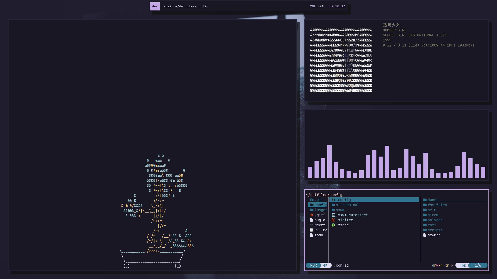

# Dragon Chicken's dotfiles
Rose pine rice featuring Kagari Mimi \
I will probably rice more programs but this is what I have so far 😓





# Packages
- WM: [sxwm](https://github.com/uint23/sxwm)
- Bar: [polybar](https://github.com/polybar/polybar)
- Compositor: [picom](https://github.com/yshui/picom)
- Launcher: [rofi](https://github.com/davatorium/rofi)
- Terminal: [st](https://github.com/gh0stzk/st-terminal) (modified version of st)
- Shell: [zsh](https://wiki.archlinux.org/title/Zsh)
- CD replacement: [zoxide](https://github.com/ajeetdsouza/zoxide)
- Editor: [nvim](https://neovim.io/)
- Fetch: [fastfetch](https://github.com/fastfetch-cli/fastfetch)
- Notifications: [dunst](https://github.com/dunst-project/dunst)
- Screenshot: [scrot](https://github.com/resurrecting-open-source-projects/scrot)
- Terminal file manager: [yazi](https://github.com/sxyazi/yazi)
- Note sync: [git](https://git-scm.com/)
- Markdown viewer: [vscode](https://code.visualstudio.com)
- Font: [maple mono](https://github.com/subframe7536/maple-font)
- Dotfile manager: [stow](https://www.gnu.org/software/stow/manual/stow.html)

# Install
You should probably install my dotfiles into your home directory, otherwise some things may not work.
1. Download the [packages](#packages) for your distro
2. Clone this repo
```sh
git clone https://github.com/Dragon-Chicken/dotfiles.git
```
3. cd and install
```sh
cd dotfiles
make # or `make install`
```
4. You have to manually patch sxwm with [my patch](sxwm/workspace_names.patch) for named workspaces. \
A YouTube tutorial on how to patch dwm (also works on sxwm): \
https://youtu.be/qIEUBvGvvRg \
(I can't be bothered to make a full ass script)

# Uninstall
To uninstall, simply run:
```sh
make uninstall
```
